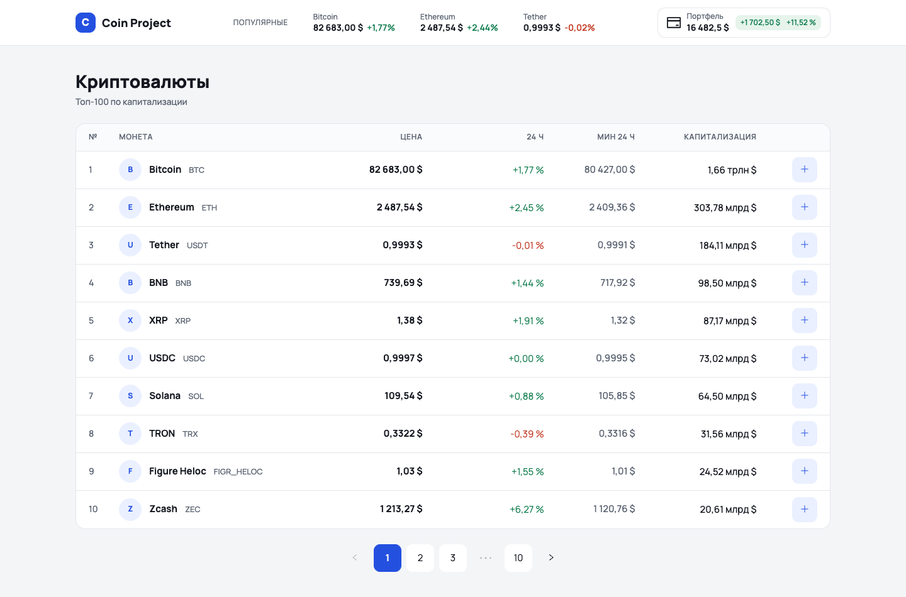
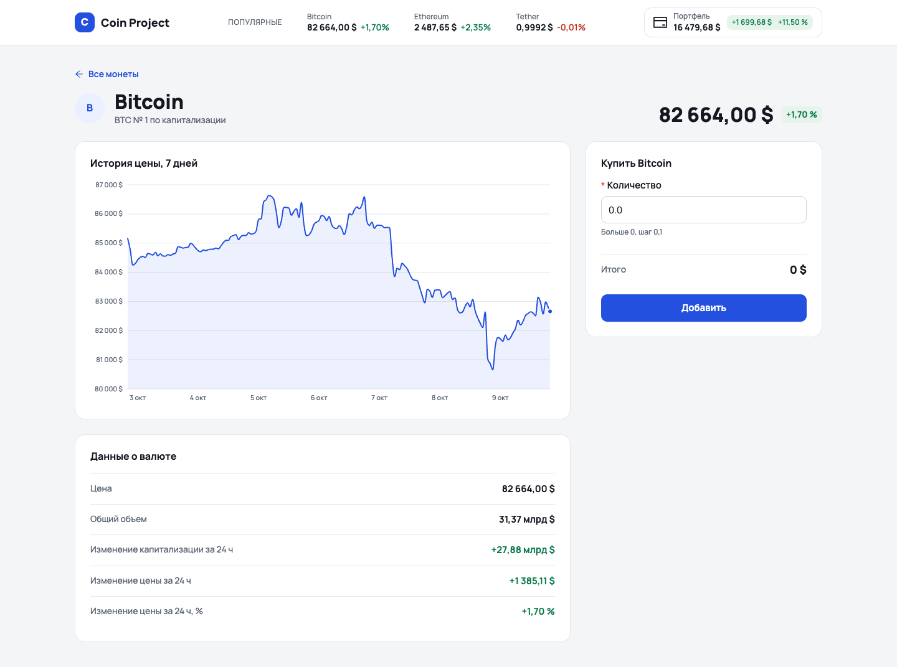
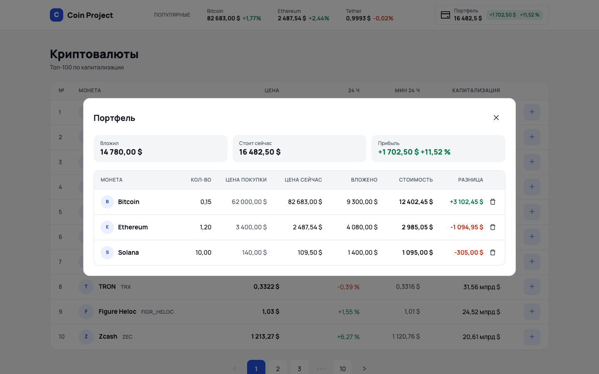
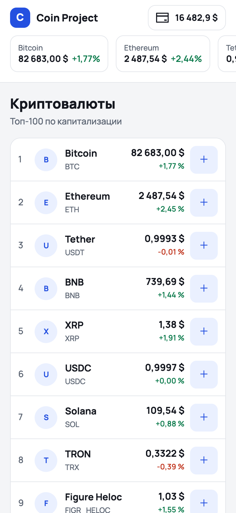
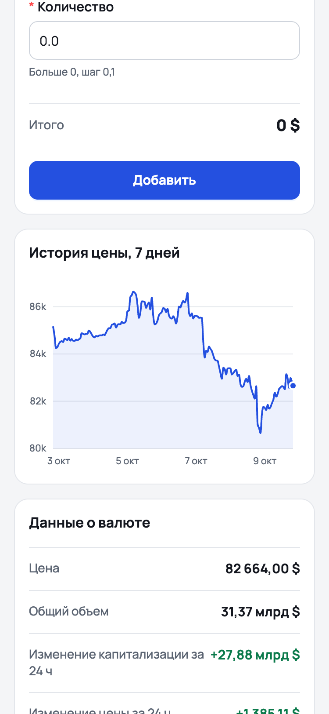
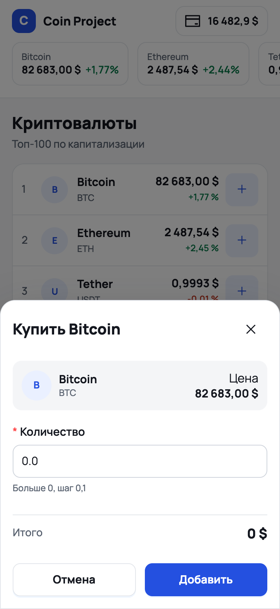
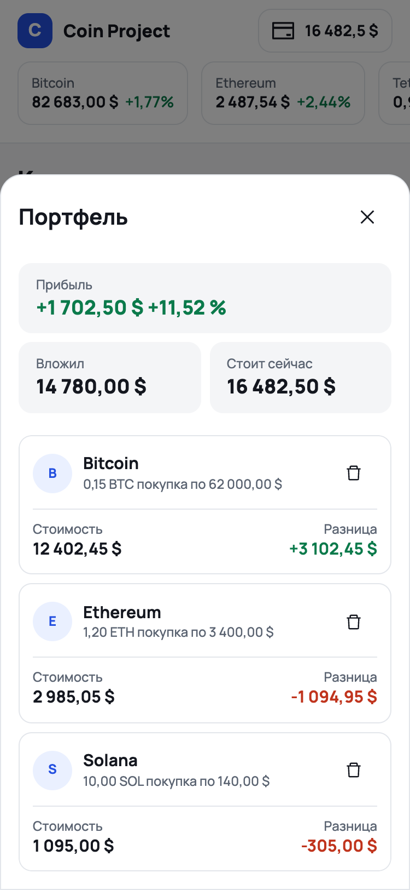

# Coin Project

Учебное приложение для отслеживания криптовалют: таблица топ-100 монет, страница монеты с графиком цены и собственный портфель с подсчётом прибыли. Данные приходят из открытого API CoinGecko.

## Скриншоты







Мобильная версия:

<p>
  
  
  
  
</p>

## Возможности

- **Таблица монет.** Топ-100 по капитализации, по 10 на странице: цена, изменение за 24 часа, минимум за сутки, капитализация.
- **Популярные монеты в шапке.** Три первые монеты с ценой и изменением видны на любой странице.
- **Страница монеты.** График цены за 7 дней, основные показатели и форма покупки.
- **Портфель.** Монету можно добавить из таблицы или со страницы монеты. При повторной покупке пересчитывается средняя цена. В модальном окне видно, сколько вложено, сколько портфель стоит сейчас и какова прибыль — по каждой монете и в сумме.
- **Сохранение между сессиями.** Портфель хранится в `localStorage`.
- **Адаптивная вёрстка.** Три раскладки: десктоп от 1200px, планшет от 768px, мобильная. На мобильной таблицы превращаются в списки и карточки, а модальные окна — в шторку снизу.

## Технологии

| Задача | Инструмент |
|---|---|
| Интерфейс | React 19, TypeScript |
| Сборка | Vite |
| Состояние | Redux Toolkit, React Context |
| Маршруты | React Router 7 |
| Запросы | Axios |
| График | D3 |
| Формы, пагинация, иконки | Ant Design |
| Стили | CSS без препроцессоров: переменные, flex, grid |

## Запуск

Нужен Node.js 20 или новее и демо-ключ CoinGecko — его бесплатно выдают в [личном кабинете](https://www.coingecko.com/en/developers/dashboard).

1. Установите зависимости:

```bash
npm install
```

2. Скопируйте файл с примером настроек и впишите в него свой ключ:

```bash
cp .env.example .env
```

```
VITE_COINGECKO_API_KEY=ваш_ключ
```

3. Запустите проект:

```bash
npm run dev
```

Приложение откроется на `http://localhost:5173`.

Остальные команды:

```bash
npm run build    # проверка типов и сборка в dist/
npm run preview  # просмотр собранной версии
npm run lint     # ESLint
```

## Структура

```
src/
  components/     переиспользуемые блоки: шапка, таблица монет, форма покупки, модальные окна
  pages/          страницы: главная и страница монеты
  layouts/        общий каркас с шапкой
  redux/          хранилище: список монет, текущая монета, портфель
  context/        расчёт стоимости и прибыли портфеля
  hooks/          свои хуки
  services/       запросы к CoinGecko
  utils/          форматирование цен, процентов и больших чисел
  styles/         CSS-переменные: цвета, отступы, скругления
```

Стили каждого компонента лежат рядом с ним в файле с тем же именем. Общие классы (`.container`, `.card`) и подключение переменных — в `src/index.css`.

## Как устроена вёрстка

- **Дизайн-токены.** Цвета, отступы и скругления заданы CSS-переменными в `src/styles/variables.css`; тема Ant Design настроена на те же значения в `src/main.tsx`.
- **Адаптив от десктопа.** Базовые стили описывают широкий экран, отличия для планшета и мобильной заданы медиа-запросами на `1199px` и `767px` в файле самого компонента.
- **Сетки.** Раскладка страницы монеты и таблица портфеля построены на CSS grid с именованными областями, поэтому на каждой ширине меняется только описание сетки, а разметка остаётся одной.
- **График.** Компонент измеряет ширину своего контейнера и перерисовывается под неё; на узком экране подписи оси сокращаются.

## Данные

Используется [CoinGecko API](https://www.coingecko.com/en/api) с демо-ключом. Ключ читается из переменной окружения `VITE_COINGECKO_API_KEY`; файл `.env` в репозиторий не попадает. У бесплатного тарифа есть ограничение на число запросов в минуту: если данные не загрузились, подождите немного и обновите страницу.

Покупки в приложении условные — реальные деньги и биржи не задействованы.
